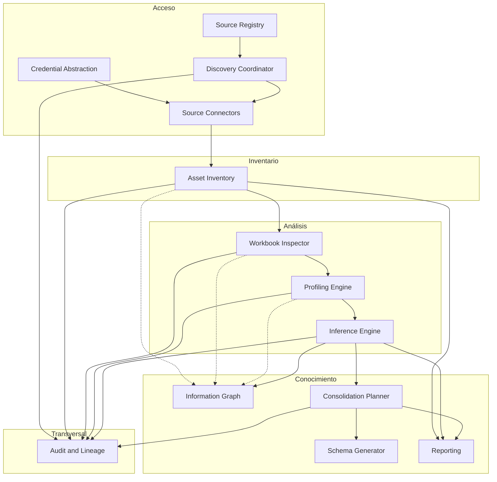
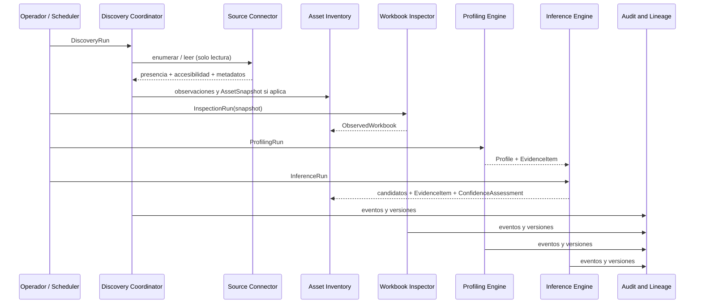

# Arquitectura

Documento conceptual (Fase 0.1). Describe responsabilidades y contratos entre subsistemas.
**No fija** lenguaje, framework, base de datos, colas, motor de grafos ni formato de configuración.

## Arquitectura ejecutable inicial (Fase 1)

Monolito modular desplegado con Compose (**Server Host**):

```text
exceler-app  →  API + application + domain + infrastructure + CLI
exceler-db   →  PostgreSQL (red interna)
```

Orígenes filesystem llegan como volúmenes `:ro` bajo `/sources/...` cuando el Server Host los materializa.
El Core es independiente del host: también se contemplan Native, Desktop y Agent ([ADR 0004](decisions/0004-execution-hosts-and-nodes.md)).

### Configuración vs accesibilidad

- **Crear/actualizar** valida configuración (sintaxis, raíces permitidas, patrones, `read_only`, credenciales por referencia).
- **`POST .../validate`** diagnostica accesibilidad actual en el nodo y devuelve un resultado estructurado (`valid`, `configuration_valid`, `accessible`, `checks`, `errors`).
- Un origen puede estar bien configurado y no ser accesible aún (mount ausente, nodo distinto, recurso caído).

### Health

- `GET /health/live` — liveness del proceso (sin PostgreSQL).
- `GET /health/ready` — readiness (PostgreSQL + configuración básica).
- `GET /health` — alias de compatibilidad de liveness.

No hay workers, colas ni SMB directo en esta fase.
Fase 2A añade el **Workbook Inspector** (lectura factual XLSX/XLSM vía openpyxl en infraestructura).

Ver [deployment.md](deployment.md), [workbook-inspection.md](workbook-inspection.md), [ADR 0002](decisions/0002-runtime-and-deployment-strategy.md) y [ADR 0003](decisions/0003-initial-technology-stack.md).

## Objetivo arquitectónico

EXCELER se organiza para:

1. descubrir e inventariar activos desde orígenes heterogéneos;
2. capturar snapshots de solo lectura para análisis reproducible;
3. inspeccionar y perfilar contenido (empezando por Excel) sin acoplar el acceso al análisis;
4. inferir candidatos de modelo con evidencias y evaluaciones de confianza separadas;
5. permitir revisión humana generalizada hacia un modelo canónico;
6. planificar consolidación y, más adelante, generar esquemas;
7. auditar linaje de extremo a extremo sobre el Information Graph conceptual.

## Capas de modelo

Las tres capas son independientes:

```text
Orígenes / Activos / Snapshots
        │
        ▼
 Modelo observado   →  hechos estructurales y de contenido
        │
        ▼
 Modelo inferido    →  candidatos + EvidenceItem + ConfidenceAssessment
        │
        ▼
 Modelo canónico    →  estructura corporativa aprobada
```

Un conector produce o facilita **activos, observaciones y, cuando procede, snapshots**.
Un inspector produce **modelo observado** en una `InspectionRun`.
Un motor de inferencia produce **modelo inferido** en una `InferenceRun`.
La consolidación y `ReviewDecision` producen **modelo canónico** y **mappings**.

## Information Graph (desde el inicio)

El grafo de información es una **vista conceptual permanente** de las relaciones entre orígenes, activos, snapshots, estructuras observadas, perfiles, inferencias, evidencias, decisiones y canónicos.

- No espera a una “fase grafo” para existir como modelo.
- Las fases posteriores materializan persistencia consultable, APIs de navegación o visualización.
- La tecnología de grafos permanece abierta (ADR futuro).

## Vista de subsistemas



Las flechas discontinuas hacia el Information Graph indican que inventario y análisis **alimentan el grafo conceptual** desde que existen, no solo tras la inferencia.

## Flujo de descubrimiento e inferencia



## Subsistemas

### 1. Source Registry

**Responsabilidad:** registrar y configurar orígenes de descubrimiento.

**Incluye:** identidad del origen, tipo, endpoint, ubicación raíz, política de exploración, límites, estado habilitado, modo solo lectura, última ejecución y errores.

**No incluye:** secretos en claro; lógica de parsing Excel.

**Contrato conceptual:** expone configuraciones de origen y referencias de credencial; recibe actualizaciones de estado desde el Discovery Coordinator.

### 2. Credential Abstraction

**Responsabilidad:** referenciar credenciales sin almacenarlas en el modelo de origen.

**Incluye:** `CredentialReference`, proveedor/almacén lógico, resolución en tiempo de ejecución hacia el conector.

**No incluye:** obligatoriedad de un vault concreto en Fase 0.

**Contrato conceptual:** los conectores reciben secretos resueltos o handles temporales; nunca persisten secretos en el inventario.

### 3. Discovery Coordinator

**Responsabilidad:** orquestar `DiscoveryRun`.

**Incluye:** seleccionar conector, aplicar políticas y límites, distinguir resultados de presencia y accesibilidad, normalizar errores de ejecución.

**No incluye:** inspección Excel, perfilado ni inferencia (esas tienen sus propias ejecuciones).

**Contrato conceptual:** habla con Source Registry + Connectors + Asset Inventory + Audit.

### 4. Source Connectors

**Responsabilidad:** adaptar tipos de origen (filesystem, SMB, SharePoint/OneDrive, etc.).

**Incluye:** validar configuración, probar conectividad y permisos, enumerar activos, leer metadatos/contenido en solo lectura, declarar `ConnectorCapability`, normalizar errores, contribuir a `AssetSnapshot` cuando se lee contenido.

**No incluye:** semántica de Excel ni inferencia de modelos.

**Contrato conceptual:** entrada = origen + credencial resuelta + política; salida = observaciones (presencia/accesibilidad), streams/metadatos, capacidades, errores normalizados.

### 5. Asset Inventory

**Responsabilidad:** inventario histórico de activos, observaciones y snapshots.

**Incluye:** `DiscoveredAsset`, `DiscoveryObservation`, `AssetSnapshot`, estados de presencia y accesibilidad separados, hashes, detección de nuevos/modificados/no observados.

**No incluye:** borrar inmediatamente un activo solo porque dejó de verse; confundir ausencia con error de lectura.

**Contrato conceptual:** consume resultados de discovery; suministra snapshots a inspección/análisis.

### 6. Workbook Inspector

**Responsabilidad:** análisis estructural factual de libros Excel en una `InspectionRun`.

**Incluye:** formato, hojas, dimensiones, tablas, rangos, nombres, fórmulas, combinaciones, validaciones, vínculos, consultas, detección de macros (sin ejecutarlas), propiedades.

**No incluye:** conocer el protocolo de origen; proponer entidades canónicas.

**Contrato conceptual:** entrada = `AssetSnapshot`; salida = `ObservedWorkbook` y derivados observados.

### 7. Profiling Engine

**Responsabilidad:** perfilar columnas/valores en una `ProfilingRun`.

**Incluye:** tipos aparentes, nulos, unicidad, cardinalidad, patrones, distribuciones, anomalías; emisión de `EvidenceItem` factuales cuando proceda.

**No incluye:** aprobación de modelo canónico ni puntuación de confianza de negocio como único artefacto.

**Contrato conceptual:** opera sobre regiones/campos observados; produce `Profile` y evidencias auxiliares.

### 8. Inference Engine

**Responsabilidad:** proponer interpretación en una `InferenceRun`.

**Incluye:** entidades, campos, tipos, claves, relaciones con extremos explícitos, catálogos, similitudes, reglas candidatas; `EvidenceItem` + `ConfidenceAssessment`.

**No incluye:** afirmar verdades absolutas ni escribir DDL productivo sin revisión.

**Contrato conceptual:** lee observado + perfiles; escribe modelo inferido y enlaces de linaje/grafo.

### 9. Information Graph

**Responsabilidad:** representar y, más adelante, materializar la navegación del conocimiento.

**Incluye (conceptual desde el inicio):** relaciones entre archivos, hojas, entidades, campos, orígenes, snapshots, inferencias, evidencias, decisiones y modelos canónicos.

**Incluye (implementación posterior):** motor de consulta, índices, visualización — tecnología por ADR.

### 10. Consolidation Planner

**Responsabilidad:** proponer consolidación y mappings hacia el modelo canónico.

**Incluye:** propuestas, conflictos, duplicidades, mappings origen→canónico, apoyo a `ReviewDecision`.

**No incluye:** aplicar cambios en los archivos Excel origen.

### 11. Schema Generator

**Responsabilidad futura:** materializar esquemas para destinos (SQL Server, PostgreSQL, SQLite, …).

**Incluye:** scripts reproducibles derivados del modelo canónico aprobado.

**No incluye:** migrar datos automáticamente sin validación.

### 12. Reporting

**Responsabilidad:** informes técnicos y ejecutivos (p. ej. Markdown/HTML).

**Incluye:** inventarios, hallazgos, riesgos, propuestas y estados de revisión.

### 13. Audit and Lineage

**Responsabilidad:** trazabilidad, historial y procedencia.

**Incluye:** quién/qué/cuándo; versión de conector/inspector/perfilador/inferidor; evidencias; evaluaciones de confianza; decisiones de revisión; cadena origen→activo→snapshot→observado→inferido→canónico.

## Contratos transversales

| Contrato | Regla |
|----------|-------|
| Solo lectura | Ningún componente de discovery/análisis escribe en el origen |
| Desacoplo | Connector ↛ Excel semantics; Inspector ↛ protocol details |
| Capas | Observed / Inferred / Canonical no se fusionan en un único registro ambiguo |
| Snapshot | El análisis reproducible se ancla a `AssetSnapshot`, no solo al activo vivo |
| Ejecuciones | Discovery, inspección, perfilado e inferencia tienen runs distintas |
| Presencia ≠ accesibilidad | Se modelan y reportan por separado |
| Evidencia / confianza | `EvidenceItem` y `ConfidenceAssessment` son artefactos distintos |
| Revisión | `ReviewDecision` aplica a cualquier sujeto revisable |
| Relación | `CandidateRelationship` declara extremos from/to explícitos |
| Grafo | El Information Graph conceptual se alimenta desde las primeras entidades |
| Secretos | Solo `CredentialReference` en configuración persistida de orígenes |
| Versiones | Cada ejecución registra versión de componente |

## Extensibilidad sin sobre-abstracción

El diseño admite futuros tipos de documento (CSV, Access, SQLite, JSON, XML, DB, API) mediante:

- activos y snapshots genéricos en inventario;
- inspectores específicos por tipo de documento;
- un núcleo de inferencia/consolidación orientado a entidades y campos, no a celdas Excel.

No se introduce una jerarquía profunda de plugins en Fase 0; solo se evita el acoplamiento prematuro.

## Despliegue (no decidido)

La arquitectura conceptual admite, en el futuro:

- CLI;
- servicio centralizado;
- agentes en equipos remotos.

La forma de empaquetado se decidirá por ADR cuando existan requisitos de ejecución concretos.

## Relacionados

- Dominio: [domain-model.md](domain-model.md)
- Seguridad: [security.md](security.md)
- Criterios tecnológicos: [technology-selection.md](technology-selection.md)
- Decisiones: [decisions/README.md](decisions/README.md)
- ADR 0001: [decisions/0001-phase-0-1-domain-and-execution-model.md](decisions/0001-phase-0-1-domain-and-execution-model.md)
