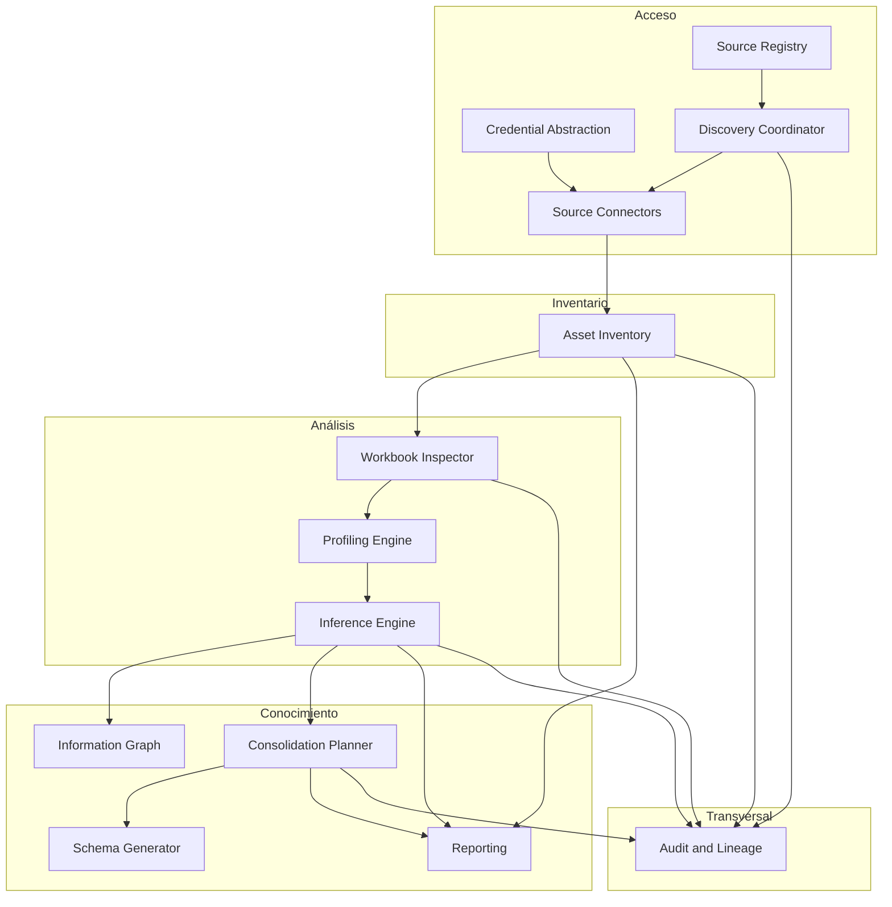
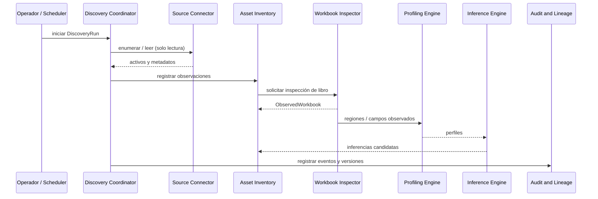

# Arquitectura

Documento conceptual. Describe responsabilidades y contratos entre subsistemas.
**No fija** lenguaje, framework, base de datos, colas, motor de grafos ni formato de configuración.

## Objetivo arquitectónico

EXCELER se organiza para:

1. descubrir e inventariar activos desde orígenes heterogéneos;
2. inspeccionar y perfilar contenido (empezando por Excel) sin acoplar el acceso al análisis;
3. inferir candidatos de modelo con evidencia y confianza;
4. permitir revisión humana hacia un modelo canónico;
5. planificar consolidación y, más adelante, generar esquemas;
6. auditar linaje de extremo a extremo.

## Capas de modelo

Las tres capas son independientes:

```text
Orígenes / Activos
        │
        ▼
 Modelo observado   →  hechos estructurales y de contenido
        │
        ▼
 Modelo inferido    →  candidatos con evidencia y confianza
        │
        ▼
 Modelo canónico    →  estructura corporativa aprobada
```

Un conector produce o facilita **activos y bytes/metadatos**.
Un inspector produce **modelo observado**.
Un motor de inferencia produce **modelo inferido**.
La consolidación y revisión producen **modelo canónico** y **mappings**.

## Vista de subsistemas



## Flujo de descubrimiento e inferencia



## Subsistemas

### 1. Source Registry

**Responsabilidad:** registrar y configurar orígenes de descubrimiento.

**Incluye:** identidad del origen, tipo, endpoint, ubicación raíz, política de exploración, límites, estado habilitado, modo solo lectura, última ejecución y errores.

**No incluye:** secretos en claro; lógica de parsing Excel.

**Contrato conceptual:** expone configuraciones de origen y referencias de credencial; recibe actualizaciones de estado desde el Discovery Coordinator.

### 2. Credential Abstraction

**Responsabilidad:** referenciar credenciales sin almacenarlas en el modelo de origen.

**Incluye:** `CredentialReference`, proveedor/almacén lógico, resolución en tiempo de ejecución hacia el conector.

**No incluye:** obligatoriedad de un vault concreto en Fase 0.

**Contrato conceptual:** los conectores reciben secretos resueltos o handles temporales; nunca persisten secretos en el inventario.

### 3. Discovery Coordinator

**Responsabilidad:** orquestar exploraciones.

**Incluye:** crear `DiscoveryRun`, seleccionar conector, aplicar políticas y límites, normalizar resultados de alto nivel, coordinar reintentos/errores de ejecución.

**No incluye:** interpretación de hojas, tablas o entidades.

**Contrato conceptual:** habla con Source Registry + Connectors + Asset Inventory + Audit.

### 4. Source Connectors

**Responsabilidad:** adaptar tipos de origen (filesystem, SMB, SharePoint, etc.).

**Incluye:** validar configuración, probar conectividad y permisos, enumerar activos, leer metadatos/contenido en solo lectura, declarar `ConnectorCapability`, normalizar errores.

**No incluye:** semántica de Excel ni inferencia de modelos.

**Contrato conceptual:** entrada = origen + credencial resuelta + política; salida = activos, streams/metadatos, capacidades, errores normalizados.

### 5. Asset Inventory

**Responsabilidad:** inventario histórico de archivos/documentos descubiertos.

**Incluye:** `DiscoveredAsset`, observaciones, estados de accesibilidad, hashes, detección de nuevos/modificados/no observados.

**No incluye:** borrar inmediatamente un activo solo porque dejó de verse en una ejecución.

**Contrato conceptual:** consume resultados de discovery; suministra candidatos a inspección.

### 6. Workbook Inspector

**Responsabilidad:** análisis estructural factual de libros Excel.

**Incluye:** formato, hojas, dimensiones, tablas, rangos, nombres, fórmulas, combinaciones, validaciones, vínculos, consultas, detección de macros (sin ejecutarlas), propiedades.

**No incluye:** conocer el protocolo de origen; proponer entidades canónicas.

**Contrato conceptual:** entrada = contenido/metadatos de activo; salida = `ObservedWorkbook` y derivados observados.

### 7. Profiling Engine

**Responsabilidad:** perfilar columnas/valores.

**Incluye:** tipos aparentes, nulos, unicidad, cardinalidad, patrones, distribuciones, anomalías.

**No incluye:** aprobación de modelo canónico.

**Contrato conceptual:** opera sobre regiones/campos observados; produce `Profile` y evidencias auxiliares.

### 8. Inference Engine

**Responsabilidad:** proponer interpretación.

**Incluye:** entidades, campos, tipos, claves, relaciones, catálogos, similitudes, reglas candidatas; siempre con evidencia y confianza.

**No incluye:** afirmar verdades absolutas ni escribir DDL productivo sin revisión.

**Contrato conceptual:** lee observado + perfiles; escribe modelo inferido y enlaces de linaje.

### 9. Information Graph

**Responsabilidad:** representar relaciones entre archivos, hojas, entidades, campos, usuarios/departamentos (cuando existan), orígenes, inferencias y modelos canónicos.

**Incluye:** modelo de relaciones consultable; no exige decidir motor de grafos todavía.

**Contrato conceptual:** se alimenta de inventario, inferencias y decisiones; sirve a reporting y consolidación.

### 10. Consolidation Planner

**Responsabilidad:** proponer consolidación y mappings hacia el modelo canónico.

**Incluye:** propuestas, conflictos, duplicidades, mappings origen→canónico, apoyo a revisión humana.

**No incluye:** aplicar cambios en los archivos Excel origen.

### 11. Schema Generator

**Responsabilidad futura:** materializar esquemas para destinos (SQL Server, PostgreSQL, SQLite, …).

**Incluye:** scripts reproducibles derivados del modelo canónico aprobado.

**No incluye:** migrar datos automáticamente sin validación.

### 12. Reporting

**Responsabilidad:** informes técnicos y ejecutivos (p. ej. Markdown/HTML).

**Incluye:** inventarios, hallazgos, riesgos, propuestas y estados de revisión.

### 13. Audit and Lineage

**Responsabilidad:** trazabilidad, historial y procedencia.

**Incluye:** quién/qué/cuándo; versión de conector/analizador; evidencias; decisiones de revisión; cadena origen→observado→inferido→canónico.

## Contratos transversales

| Contrato | Regla |
|----------|-------|
| Solo lectura | Ningún componente de discovery/análisis escribe en el origen |
| Desacoplo | Connector ↛ Excel semantics; Inspector ↛ protocol details |
| Capas | Observed / Inferred / Canonical no se fusionan en un único registro ambiguo |
| Evidencia | Toda inferencia referencia evidencias y puntuación de confianza |
| Secretos | Solo `CredentialReference` en configuración persistida de orígenes |
| Versiones | Cada análisis registra versión de componente |

## Extensibilidad sin sobre-abstracción

El diseño admite futuros tipos de documento (CSV, Access, SQLite, JSON, XML, DB, API) mediante:

- activos genéricos en inventario;
- inspectores específicos por tipo de documento;
- un núcleo de inferencia/consolidación orientado a entidades y campos, no a celdas Excel.

No se introduce una jerarquía profunda de plugins en Fase 0; solo se evita el acoplamiento prematuro.

## Despliegue (no decidido)

La arquitectura conceptual admite, en el futuro:

- CLI;
- servicio centralizado;
- agentes en equipos remotos.

La forma de empaquetado se decidirá por ADR cuando existan requisitos de ejecución concretos.

## Relacionados

- Dominio: [domain-model.md](domain-model.md)
- Seguridad: [security.md](security.md)
- Criterios tecnológicos: [technology-selection.md](technology-selection.md)
- Decisiones: [decisions/README.md](decisions/README.md)
