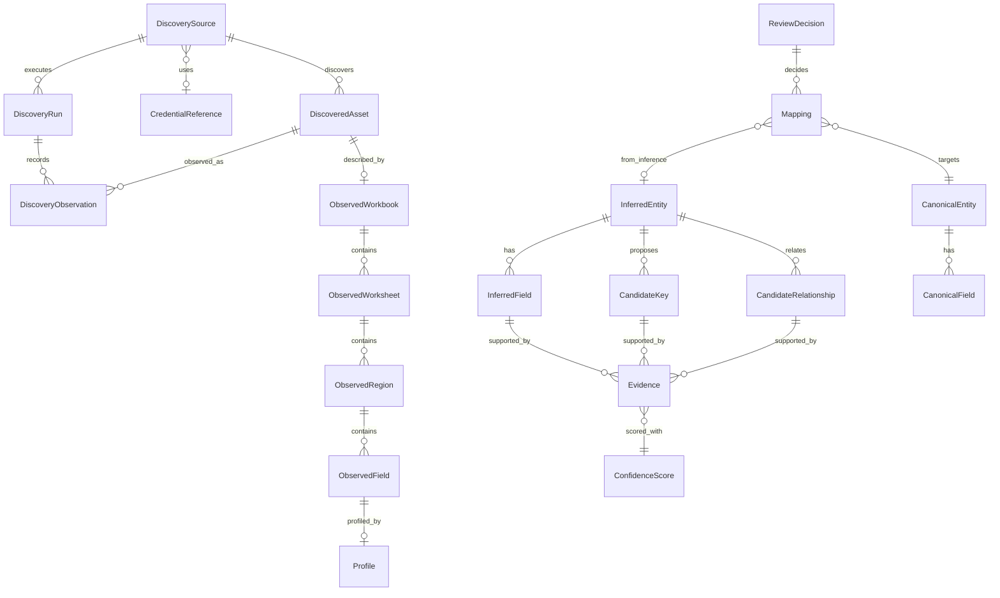

# Modelo de dominio

Modelo conceptual. Los nombres pueden evolucionar mediante ADR; deben permanecer coherentes con [terminology.md](terminology.md).

## Capas

| Capa | Pregunta que responde | Ejemplos |
|------|----------------------|----------|
| Observado | ¿Qué se vio, sin reinterpretar? | `ObservedWorkbook`, `ObservedField` |
| Inferido | ¿Qué proponemos y con qué evidencia? | `InferredEntity`, `CandidateKey` |
| Canónico | ¿Qué se aprobó como estructura corporativa? | `CanonicalEntity`, `Mapping` |

## Mapa de relaciones (vista compacta)

## Entidades conceptuales

### DiscoverySource

Ubicación explorable con mecanismo de acceso, identidad, alcance y política.

**Responsabilidad:** definir *dónde* y *cómo* se puede descubrir, no *qué significa* el contenido.

**Atributos conceptuales típicos:** identificador, nombre, tipo, endpoint, ubicación raíz, mecanismo de autenticación, `CredentialReference`, habilitado/deshabilitado, modo solo lectura, recursividad, patrones include/exclude, límites operativos, frecuencia/política, última ejecución correcta, último error, configuración específica del conector.

**Relaciones:** usa `CredentialReference`; origina `DiscoveryRun` y `DiscoveredAsset`.

### CredentialReference

Puntero a un secreto en un almacén externo o proveedor de identidad.

**Responsabilidad:** desacoplar configuración de origen y material secreto.

**No almacena** usuario/contraseña/token en el registro del origen.

### ConnectorCapability

Declaración de lo que un conector puede hacer (listar, leer contenido, metadatos, permisos, versiones, historial, hash, detectar cambios, archivos bloqueados, etc.).

**Responsabilidad:** permitir al coordinador adaptar la exploración a lo disponible.

### DiscoveredAsset

Archivo o documento observado en un origen.

**Distingue:**

- identidad interna EXCELER;
- identificador externo estable (si el origen lo ofrece);
- ruta/ubicación visible;
- metadatos observados;
- estado de accesibilidad;
- huella/hash;
- historial de observaciones.

**Relaciones:** pertenece a un `DiscoverySource`; acumula `DiscoveryObservation`; puede asociarse a un `ObservedWorkbook` (u otro inspector futuro).

### DiscoveryRun

Ejecución concreta de exploración sobre un origen.

**Recoge:** inicio/fin, estado, contadores (encontrados, nuevos, modificados, no encontrados, omitidos), errores, volumen leído, versión del conector.

### DiscoveryObservation

Hecho de haber observado un activo en una ejecución.

**Responsabilidad:** historial fino; permite marcar “no observado en esta run” sin borrar el activo del inventario.

### ObservedWorkbook

Descripción factual de un libro Excel.

**Conserva lo observado:** formato, hojas, dimensiones, tablas, rangos, nombres definidos, fórmulas, celdas combinadas, validaciones, vínculos externos, consultas, macros detectadas, propiedades, características.

**No interpreta** todavía entidades de negocio.

### ObservedWorksheet

Hoja observada dentro de un libro.

### ObservedRegion

Región o área tabular candidata dentro de una hoja (tabla Excel, rango usado, bloque detectado, etc.).

**Responsabilidad:** delimitar el perímetro factual sobre el que se perfila e infiere.

### ObservedField

Columna o campo observado dentro de una región (encabezado aparente, posición, muestras estructurales).

### Profile

Resultado de perfilado de un campo o región: tipos aparentes, nulos, unicidad, cardinalidad, patrones, distribuciones, anomalías.

### InferredEntity

Entidad de negocio candidata.

**Siempre** acompañada de evidencias, confianza, advertencias/conflictos y estado de revisión.

### InferredField

Campo candidato perteneciente a una entidad inferida, con tipo candidato y linaje hacia `ObservedField` / región / hoja / libro.

### CandidateKey

Propuesta de clave (natural, compuesta, surrogate aparente) con evidencia de unicidad/estabilidad.

### CandidateRelationship

Propuesta de relación entre entidades o campos (dentro de un libro o entre libros), con cardinalidad candidata y evidencia.

### Evidence

Hecho o conjunto de hechos que sustentan una inferencia (p. ej. unicidad observada, coincidencia de nombres, solapamiento de valores, vínculo externo).

### ConfidenceScore

Nivel de confianza asociado a una inferencia o evidencia agregada.

No es una verdad: es una señal para priorizar revisión.

### CanonicalEntity

Entidad aprobada del modelo corporativo consolidado.

Separada de las inferencias que la motivaron.

### CanonicalField

Campo aprobado dentro de una entidad canónica.

### Mapping

Correspondencia entre elementos observados/inferidos y elementos canónicos.

**Responsabilidad:** preservar trazabilidad de consolidación.

### ReviewDecision

Decisión humana (o flujo de aprobación) sobre una inferencia, mapping o propuesta de consolidación: aprobar, rechazar, diferir, pedir más evidencia.

**Debe registrar:** actor, momento, objeto decidido, resultado y comentario.

## Responsabilidades por capa (resumen)

| Capa | Puede afirmar | No debe afirmar |
|------|---------------|-----------------|
| Observado | “La hoja X tiene una tabla en A1:D200” | “Es la entidad Cliente” |
| Inferido | “Hay evidencia de entidad Cliente con confianza 0.72” | “Este es el modelo oficial” |
| Canónico | “Cliente.Codigo es clave aprobada” | “El archivo origen ya está migrado” |

## Ciclo de vida simplificado

1. Se configura un `DiscoverySource` con `CredentialReference`.
2. Un `DiscoveryRun` enumera y observa activos.
3. El inventario actualiza `DiscoveredAsset` + `DiscoveryObservation`.
4. El inspector materializa `ObservedWorkbook` y estructura.
5. El perfilado genera `Profile`.
6. La inferencia propone entidades/claves/relaciones con `Evidence` y `ConfidenceScore`.
7. La revisión produce `ReviewDecision` y eventualmente `CanonicalEntity` + `Mapping`.
8. Audit/Lineage enlaza todo el recorrido.

## Relacionados

- Arquitectura: [architecture.md](architecture.md)
- Terminología: [terminology.md](terminology.md)
- Seguridad: [security.md](security.md)
