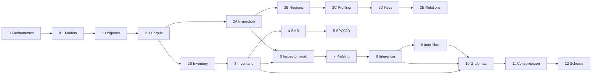

# Roadmap

Roadmap incremental. Las fases son orden de aprendizaje y entrega, no un compromiso de calendario.

**Nomenclatura de la franja Excel (Alternativa B):**

| Id | Nombre | Rol |
|----|--------|-----|
| **2.0** | Synthetic Workbook Corpus | Laboratorio sintético (cerrado) |
| **2S** | Source Inventory | Inventario filesystem de orígenes |
| **2A** | Workbook Inspection | Lectura estructural factual |
| **2B** | Region and Table Detection | Regiones y tablas lógicas |
| **2C** | Profiling and Type Inference | Perfilado e inferencia de tipos |
| **2D** | Key Detection | Candidatos a clave |
| **2E** | Relationship Detection | Relaciones intra/inter-libro |

Las fases numeradas 3–12 del roadmap largo siguen vigentes como entregas de producto;
2S/2A–2E son cortes de implementación que alimentan esas entregas sin solaparse en alcance.

Estado actual: **Fase 2A cerrada** — Workbook Inspection Foundation endurecida.
Siguiente corte: **2B** (ampliar corpus primero).

## Fase 0 — Fundamentos

- Visión, alcance y principios.
- Arquitectura de subsistemas y contratos conceptuales.
- Modelo de dominio y terminología.
- Seguridad y criterios tecnológicos.
- Repositorio documental y proceso ADR.
- Estrategia de pruebas con muestras sintéticas (documentada).

**Salida:** base documental inicial.

## Fase 0.1 — Corrección del modelo temporal y de ejecución

- `AssetSnapshot` como ancla del análisis reproducible.
- Ejecuciones distintas: `DiscoveryRun`, `InspectionRun`, `ProfilingRun`, `InferenceRun`.
- `CandidateRelationship` con extremos explícitos.
- Separación `EvidenceItem` / `ConfidenceAssessment`.
- `ReviewDecision` generalizada a sujetos revisables.
- Presencia y accesibilidad como dimensiones ortogonales.
- Information Graph reconocido como modelo conceptual desde el inicio.
- Adelanto de SMB y SharePoint/OneDrive en el roadmap de conectores.

**Salida:** dominio y arquitectura coherentes antes de implementar. Ver [ADR 0001](decisions/0001-phase-0-1-domain-and-execution-model.md).

## Fase 1 — Registro de orígenes

- Modelo de `DiscoverySource`.
- Validación de configuración y rutas filesystem bajo raíces permitidas.
- Declaración de capacidades esperadas (filesystem en esta fase).
- `CredentialReference` (abstracción; sin secretos en claro).
- Persistencia PostgreSQL + migraciones Alembic.
- API REST + CLI administrativa.
- Auditoría esencial de cambios.
- Docker Compose de referencia.

**Salida:** orígenes configurables y validables sin enumeración completa de archivos ni análisis Excel.

## Fase 2.0 — Synthetic Workbook Corpus

- Generador determinista de libros Excel (`tests/generators/`).
- Fixtures mínimos + escenario corporativo `hell_erp`.
- Manifiestos, expected skeletons (`schema_version`) e índice derivado.
- Instantánea lógica enriquecida + `exceler dev fixtures generate|verify`.
- Pruebas negativas del verificador; verificación en CI.

**Salida:** laboratorio reproducible antes de cualquier análisis Excel.
**Fuente de verdad del catálogo:** `tests.generators.catalog.ALL_SPECS` (`index.json` es derivado).

## Fase 2S — Source Inventory (filesystem)

*(Puede avanzar en paralelo documentalmente; el análisis Excel exige 2.0 y amplía corpus en 2A+.)*

- Rutas locales y montadas.
- Enumeración y filtros include/exclude.
- Metadatos básicos; presencia vs accesibilidad.
- Hash opcional; contribución a `AssetSnapshot`.
- Errores normalizados.
- Pruebas de no mutación del origen.

**Salida:** primer conector útil en entornos controlados (alimenta la Fase 3).

## Fase 2A — Workbook Inspection

- Corpus ampliado (tipos físicos, veryHidden, freeze/filtro, VBA stub, dimensión inflada/patológica, …).
- Modelo `WorkbookInspection` independiente de openpyxl.
- Puerto `WorkbookReader` + `OpenPyxlWorkbookReader`.
- CLI `exceler workbook inspect` (text/json; exit 7 = parcial).
- Expected bajo `expectations.inspection`; comparador parcial.
- Hardening: hash del payload, `cells_scanned`/`cells_observed`, `completion_status`, schema JSON **2**.
- ADR 0005 (openpyxl).

**Salida:** observador fiable sin interpretación 2B–2E. **Cerrada.**

## Fase 2B — Region and Table Detection

Antes: escenarios con regiones separadas, títulos, subtotales, cabeceras multinivel y ruido.

## Fase 2C — Profiling and Type Inference

Antes: columnas inequívocas, ambiguas, mixtas y semánticas.

## Fase 2D — Key Detection

Antes: unicidad, casi unicidad, duplicados, claves compuestas y falsos candidatos.

## Fase 2E — Relationship Detection

Antes: coincidencias exactas, parciales, normalizadas, ambiguas y falsas relaciones.

## Fase 3 — Inventario y ejecuciones de descubrimiento

- `DiscoveredAsset`, `DiscoveryRun`, `DiscoveryObservation`, `AssetSnapshot`.
- Nuevos / modificados / no observados / potencialmente eliminados.
- Histórico sin borrado inmediato por desaparición.
- Resumen de ejecución.
- Alimentación inicial del Information Graph conceptual (persistencia mínima de relaciones de inventario).

**Salida:** inventario reproducible entre runs.

## Fase 4 — Conector SMB

- Recursos SMB/CIFS.
- Autenticación vía `CredentialReference`.
- Enumeración, filtros, metadatos, errores normalizados.
- Paridad de contrato con el conector de filesystem (presencia, accesibilidad, snapshot).

**Salida:** descubrimiento en compartidos de red empresariales típicos.

## Fase 5 — Conectores SharePoint / OneDrive

- Bibliotecas y rutas documentales Microsoft 365 / SharePoint.
- Identificadores externos estables cuando el origen los ofrezca.
- Metadatos, versiones si la capacidad existe, límites y errores normalizados.
- Solo lectura; sin alterar permisos ni contenidos.

**Salida:** cobertura de orígenes documentales cloud frecuentes.

## Fase 6 — Inspección estructural de Excel (producto)

Entrega de producto alineada con el corte **2A** (y posteriores ampliaciones).

- `InspectionRun`.
- Formatos soportados (prioridad XLSX/XLSM; XLS según viabilidad).
- Hojas, rangos, tablas, nombres, fórmulas, vínculos.
- Detección de macros **sin ejecución**.
- `ObservedWorkbook` anclado a `AssetSnapshot`.

**Salida:** modelo observado factual.

## Fase 7 — Perfilado de datos

Alineada con **2C**.

- `ProfilingRun`.
- Tipos aparentes, nulos, unicidad, cardinalidad.
- Patrones, distribuciones, anomalías.
- `EvidenceItem` factuales; límites de muestreo y sensibilidad.

**Salida:** `Profile` ligado a campos/regiones observadas.

## Fase 8 — Inferencia inicial

Incluye cortes **2B/2D** según avance.

- `InferenceRun`.
- Encabezados y entidades candidatas.
- Campos y tipos candidatos.
- Claves candidatas.
- Relaciones internas con extremos explícitos.
- `EvidenceItem` + `ConfidenceAssessment` + `ReviewDecision`.

**Salida:** primer modelo inferido revisable.

## Fase 9 — Relaciones entre libros

Alineada con **2E**.

- Similitud de esquemas y datos.
- Claves compartidas y duplicidades.
- Linaje probable entre archivos.
- Extremos inter-libro, confianza y conflictos.

**Salida:** propuestas inter-libro.

## Fase 10 — Navegación del Information Graph

- Materialización consultable del grafo ya conceptual.
- Consultas y navegación.
- Visualización (formato libre; tecnología por ADR).

**Salida:** exploración operativa del conocimiento acumulado (el grafo no “nace” aquí; se opera).

## Fase 11 — Consolidación asistida

- Propuestas de modelo canónico.
- Conflictos y duplicados.
- Mappings.
- Flujo de revisión humana generalizada.

**Salida:** canónico aprobado de forma asistida.

## Fase 12 — Generación de esquema

- Destinos: SQL Server, PostgreSQL, SQLite (u otros acordados).
- Scripts reproducibles.
- Sin migración automática ciega.

**Salida:** materialización de esquema a partir del canónico.

## Más allá (indicativo)

- SFTP y otros protocolos;
- agentes en equipos remotos;
- reporting ejecutivo sistemático;
- otros tipos de documento (CSV, Access, JSON, …);
- ejecución distribuida;
- CLI / servicio según necesidad.

## Dependencias entre fases

SMB (4) y SharePoint/OneDrive (5) pueden avanzar en paralelo al inicio de la inspección (6 / 2A) cuando el inventario (3 / 2S) ya sea usable.

## Criterio para avanzar de fase

No se considera cerrada una fase solo por existir código esqueleto. Debe haber:

- contratos claros;
- pruebas reproducibles cuando haya implementación;
- documentación alineada con el comportamiento real;
- ADR si se fija tecnología o se cambia el dominio;
- escenario sintético positivo/negativo (y ambiguo si aplica) antes de cada capacidad 2A–2E.

## Relacionados

- Alcance: [scope.md](scope.md)
- Arquitectura: [architecture.md](architecture.md)
- Dominio: [domain-model.md](domain-model.md)
- Fixtures: [fixtures.md](fixtures.md)
