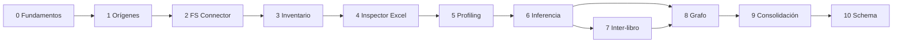

# Roadmap

Roadmap incremental. Las fases son orden de aprendizaje y entrega, no un compromiso de calendario.

Estado actual: **Fase 0 en curso** (definición arquitectónica).

## Fase 0 — Fundamentos

- Visión, alcance y principios.
- Arquitectura de subsistemas y contratos conceptuales.
- Modelo de dominio y terminología.
- Seguridad y criterios tecnológicos.
- Repositorio documental y proceso ADR.
- Estrategia de pruebas con muestras sintéticas (documentada).

**Salida:** base documental coherente, sin implementación de producto.

## Fase 1 — Registro de orígenes

- Modelo de `DiscoverySource`.
- Validación de configuración.
- Declaración de capacidades esperadas.
- `CredentialReference` (abstracción).
- Persistencia/configuración del registro (tecnología aún por ADR).

**Salida:** orígenes configurables sin exploración real obligatoria.

## Fase 2 — Conector de sistema de archivos

- Rutas locales y montadas.
- Enumeración y filtros include/exclude.
- Metadatos básicos.
- Hash opcional.
- Errores normalizados.
- Pruebas de no mutación del origen.

**Salida:** primer conector útil en entornos controlados.

## Fase 3 — Inventario y ejecuciones

- `DiscoveredAsset`, `DiscoveryRun`, `DiscoveryObservation`.
- Nuevos / modificados / no observados.
- Histórico sin borrado inmediato por desaparición.
- Resumen de ejecución.

**Salida:** inventario reproducible entre runs.

## Fase 4 — Inspección estructural de Excel

- Formatos soportados (prioridad XLSX/XLSM; XLS según viabilidad).
- Hojas, rangos, tablas, nombres, fórmulas, vínculos.
- Detección de macros **sin ejecución**.
- `ObservedWorkbook` y estructura asociada.

**Salida:** modelo observado factual.

## Fase 5 — Perfilado de datos

- Tipos aparentes, nulos, unicidad, cardinalidad.
- Patrones, distribuciones, anomalías.
- Límites de muestreo y sensibilidad.

**Salida:** `Profile` ligado a campos/regiones observadas.

## Fase 6 — Inferencia inicial

- Encabezados y entidades candidatas.
- Campos y tipos candidatos.
- Claves candidatas.
- Relaciones internas a un libro.
- Evidencia + confianza + estado de revisión.

**Salida:** primer modelo inferido revisable.

## Fase 7 — Relaciones entre libros

- Similitud de esquemas y datos.
- Claves compartidas y duplicidades.
- Linaje probable entre archivos.
- Confianza y conflictos.

**Salida:** propuestas inter-libro.

## Fase 8 — Grafo de información

- Modelo de relaciones entre activos, estructuras, inferencias y canónicos.
- Consultas y navegación.
- Visualización (formato libre; tecnología por ADR).

**Salida:** exploración del conocimiento acumulado.

## Fase 9 — Consolidación asistida

- Propuestas de modelo canónico.
- Conflictos y duplicados.
- Mappings.
- Flujo de revisión humana.

**Salida:** canónico aprobado de forma asistida.

## Fase 10 — Generación de esquema

- Destinos: SQL Server, PostgreSQL, SQLite (u otros acordados).
- Scripts reproducibles.
- Sin migración automática ciega.

**Salida:** materialización de esquema a partir del canónico.

## Más allá (indicativo)

No numerado aún, pero previsible:

- conectores SMB / SharePoint / OneDrive / SFTP / agentes;
- reporting ejecutivo sistemático;
- otros tipos de documento (CSV, Access, JSON, …);
- ejecución distribuida;
- CLI / servicio según necesidad.

## Dependencias entre fases

## Criterio para avanzar de fase

No se considera cerrada una fase solo por existir código esqueleto. Debe haber:

- contratos claros;
- pruebas reproducibles cuando haya implementación;
- documentación alineada con el comportamiento real;
- ADR si se fija tecnología o se cambia el dominio.

## Relacionados

- Alcance: [scope.md](scope.md)
- Arquitectura: [architecture.md](architecture.md)
